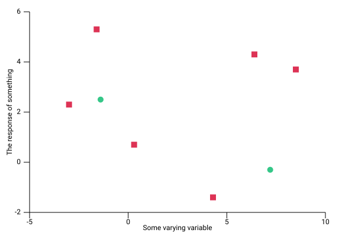

# plotlib

[](https://travis-ci.org/milliams/plotlib)

`plotlib` is a generic data visualisation and plotting library for Rust.
It is currently in the very early stages of development.

It can currently produce:

* histograms
* scatter plots
* line graphs from data or from function definitions
* box plots
* bar charts

rendering them as either SVG or plain text.

The API is still very much in flux and is subject to change.

For example, code like:

```rust
extern crate plotlib;
use plotlib::scatter::Scatter;
use plotlib::scatter;
use plotlib::style::{Marker, Point};
use plotlib::view::View;
use plotlib::page::Page;

fn main() {
    // Scatter plots expect a list of pairs
    let data1 = [(-3.0, 2.3), (-1.6, 5.3), (0.3, 0.7), (4.3, -1.4), (6.4, 4.3), (8.5, 3.7)];

    // We create our scatter plot from the data
    let s1 = Scatter::from_slice(&data1)
        .style(scatter::Style::new()
            .marker(Marker::Square) // setting the marker to be a square
            .colour("#DD3355")); // and a custom colour

    // We can plot multiple data sets in the same view
    let data2 = [(-1.4, 2.5), (7.2, -0.3)];
    let s2 = Scatter::from_slice(&data2)
        .style(scatter::Style::new() // uses the default marker
            .colour("#35C788")); // and a different colour

    // The 'view' describes what set of data is drawn
    let v = View::new()
        .add(&s1)
        .add(&s2)
        .x_range(-5., 10.)
        .y_range(-2., 6.)
        .x_label("Some varying variable")
        .y_label("The response of something");

    // A page with a single view is then saved to an SVG file
    Page::single(&v).save("scatter.svg");
}
```

will produce output like:


